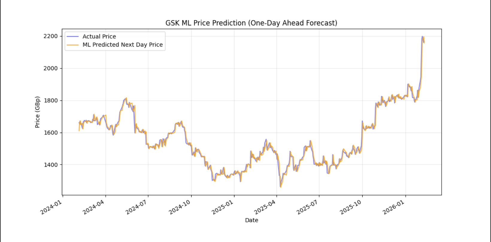

# GSK Stock Price Prediction - Monte Carlo Simulation

This project uses **Machine Learning** and **Geometric Brownian Motion** to forecast and simulate 10,000 potential price paths for GlaxoSmithKline (**GSK.L**) over an 18-month investment horizon.

## Overview
1. **Data Management:** Extraction and filtering of GSK and FTSE 100 daily financial dataset since the beginning of FY2022 with calculation of features used in ML model.
2. **Machine Learning Forecast:** A daily resetting Random Forest model to predict next day price change movements in GBX.
3. **Probability Distribution:** 10,000 path Monte Carlo simulation using the past 390 days of financial data for GSK

## Structure

### 1. "gsk_prep_data.py"
* **Data Source:** Yahoo Finance ("yfinance").
* **Calculations:** Log returns, rolling volatility, and annual drift.
* **Output:** "gsk_daily.csv", clean dataset of GSK and FSTE 100 financial data used for modelling.

### 2. "gsk_ml_model.py"
* **Approach:** Reads "gsk_daily.csv" and uses its dataset in calculations for metrics like lagged returns, moving average/gap, and rolling volatility.
* **Machine Learning Model:** A Random Forest Regressor model (200 trees, depth 5) that uses walk-forward validation to predict price changes.
* **Visualisation:** It then plots the actual daily closing price of GSK against the ML predicted daily closing price. 

### 3. "gsk_monte_carlo.py"
* **Method:** Geometric Brownian Motion.
* **Parameters** 10,000 simulations over a 390-day (18-month) horizon.
* **Result:** A probability distribution of 500 random paths, current price, and average price path.

